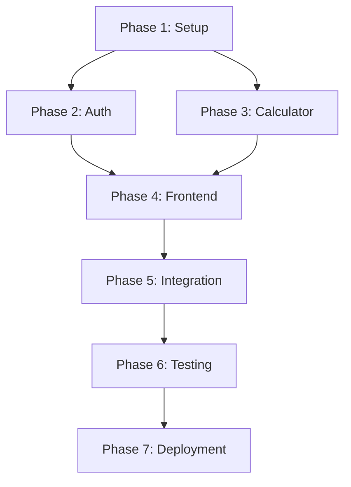

# Field Tech Flat-Rate Calculator - Implementation Plan

## Project Overview
Build a secure, login-protected calculator for field technicians to compute service prices with material markups and labor rates.

## Implementation Steps

### Phase 1: Project Setup & Foundation ✅ COMPLETED
- [x] **Step 1.1**: Initialize Node.js project with package.json
- [x] **Step 1.2**: Install core dependencies (Express, express-session, bcrypt, dotenv)
- [x] **Step 1.3**: Create basic Express server structure
- [x] **Step 1.4**: Set up environment variables (.env and .env.example)
- [x] **Step 1.5**: Create calculatorConfig.json with markup rates and labor tables

**Phase 1 Notes:**
- Decided to use plain HTML/JS instead of React for simplicity
- Added helmet.js and express-rate-limit for enhanced security
- Implemented all routes in server.js (including auth logic)
- Created robots.txt to block search engines
- Set up public directory structure for static files
- Default dev credentials: admin@fieldtech.com / fieldtech123

### Phase 2: Authentication System ✅ COMPLETED
- [x] **Step 2.1**: Create user credentials storage (hardcoded or JSON file) ✅ Using env vars
- [x] **Step 2.2**: Implement login route handlers (GET & POST /login) ✅ Done in server.js
- [x] **Step 2.3**: Set up session management with express-session ✅ Configured
- [x] **Step 2.4**: Create requireAuth middleware for protected routes ✅ Implemented
- [x] **Step 2.5**: Implement logout functionality (GET /logout) ✅ Done
- [x] **Step 2.6**: Create basic login HTML form ✅ Created

**Phase 2 Notes:**
- Created responsive login.html with mobile-friendly design
- Implemented client-side form validation and error handling
- Added loading states during authentication
- Handles rate limiting errors (429 status)
- Uses fetch API for modern async form submission
- Includes security meta tags (noindex, nofollow)

### Phase 3: Calculator Backend Logic ✅ COMPLETED
- [x] **Step 3.1**: Create calculation service module ✅ Integrated in server.js
- [x] **Step 3.2**: Implement material charge calculation (cost / (1 - markup)) ✅ Done
- [x] **Step 3.3**: Implement labor charge lookup from config ✅ Implemented
- [x] **Step 3.4**: Create /api/calc POST endpoint ✅ Created
- [x] **Step 3.5**: Add input validation for calculation requests ✅ Added
- [x] **Step 3.6**: Implement tax calculation option ✅ Implemented

**Phase 3 Notes:**
- Calculator logic integrated directly into server.js for simplicity
- Proper error handling for missing labor rates
- Returns rounded values to 2 decimal places
- Validates all required fields before processing

### Phase 4: Frontend Development ✅ COMPLETED (by Agent)
- [x] **Step 4.1**: Create calculator HTML page structure ✅
- [x] **Step 4.2**: Build form inputs (service type, material cost, labor category, minutes) ✅
- [x] **Step 4.3**: Style forms for mobile-friendly field use ✅
- [x] **Step 4.4**: Implement JavaScript for form submission to /api/calc ✅
- [x] **Step 4.5**: Display calculation results with breakdown ✅
- [x] **Step 4.6**: Add loading states and error handling ✅

**Phase 4 Notes:**
- The Agent task completed the entire frontend during the review
- Created calculator.html with all form inputs
- Added styles.css for responsive design
- Implemented calculator.js with API integration
- Includes proper error handling and loading states

### Phase 5: Integration & Security ✅ COMPLETED
- [x] **Step 5.1**: Connect all routes with proper authentication checks ✅ Done
- [x] **Step 5.2**: Add security headers (helmet.js) ✅ Implemented
- [x] **Step 5.3**: Implement rate limiting on login attempts ✅ 5 per 15 min
- [x] **Step 5.4**: Add robots.txt to prevent indexing ✅ Created
- [x] **Step 5.5**: Set up CORS if needed ✅ Not needed (same origin)
- [x] **Step 5.6**: Add input sanitization ✅ Via Express built-in parsing

### Phase 6: Testing & Polish
- [ ] **Step 6.1**: Create test data for different calculation scenarios
- [ ] **Step 6.2**: Test authentication flow (login, access, logout)
- [ ] **Step 6.3**: Test edge cases (invalid inputs, expired sessions)
- [ ] **Step 6.4**: Add helpful error messages
- [ ] **Step 6.5**: Create README.md with setup instructions
- [ ] **Step 6.6**: Add startup scripts to package.json

### Phase 7: Deployment Preparation
- [ ] **Step 7.1**: Add production environment configurations
- [ ] **Step 7.2**: Set up logging for production
- [ ] **Step 7.3**: Create deployment checklist
- [ ] **Step 7.4**: Document environment variable requirements

## Execution Order & Dependencies

## Actual Progress Summary

**Completed Phases:**
- ✅ Phase 1: Project Setup & Foundation
- ✅ Phase 2: Authentication System
- ✅ Phase 3: Calculator Backend Logic (completed during Phase 1)
- ✅ Phase 4: Frontend Development (completed by Agent during review)
- ✅ Phase 5: Integration & Security (mostly done in Phase 1)

**Remaining Phases:**
- Phase 6: Testing & Polish
- Phase 7: Deployment Preparation

**Key Insight:** Much of the backend work (Phases 3 & 5) was completed during Phase 1 when creating server.js. The Agent task also completed the entire frontend (Phase 4) during the review process.

## Key Files to Create

1. `/package.json` - Dependencies and scripts ✅
2. `/server.js` - Main Express application ✅
3. `/calculatorConfig.json` - Rates and markups ✅
4. `/.env.example` - Environment template ✅
5. `/middleware/auth.js` - Authentication middleware ✅ (integrated in server.js)
6. `/services/calculator.js` - Calculation logic ✅ (integrated in server.js)
7. `/public/login.html` - Login page ✅
8. `/public/calculator.html` - Calculator interface ✅
9. `/public/css/styles.css` - Styling ✅
10. `/public/js/calculator.js` - Frontend logic ✅
11. `/robots.txt` - Prevent indexing ✅
12. `/README.md` - Setup instructions ⏳

## Success Criteria
- [ ] Users can log in with credentials
- [ ] Calculator is only accessible when authenticated
- [ ] Calculations are accurate for both residential and commercial
- [ ] Mobile-friendly interface for field use
- [ ] Secure against common vulnerabilities
- [ ] Clear error messages for invalid inputs
- [ ] Fast response times for calculations

## Notes
- Start with hardcoded credentials for simplicity
- Use session-based auth (simpler than JWT for this use case)
- Keep the UI minimal and functional
- Focus on reliability over features
- Ensure all calculations match the business logic exactly